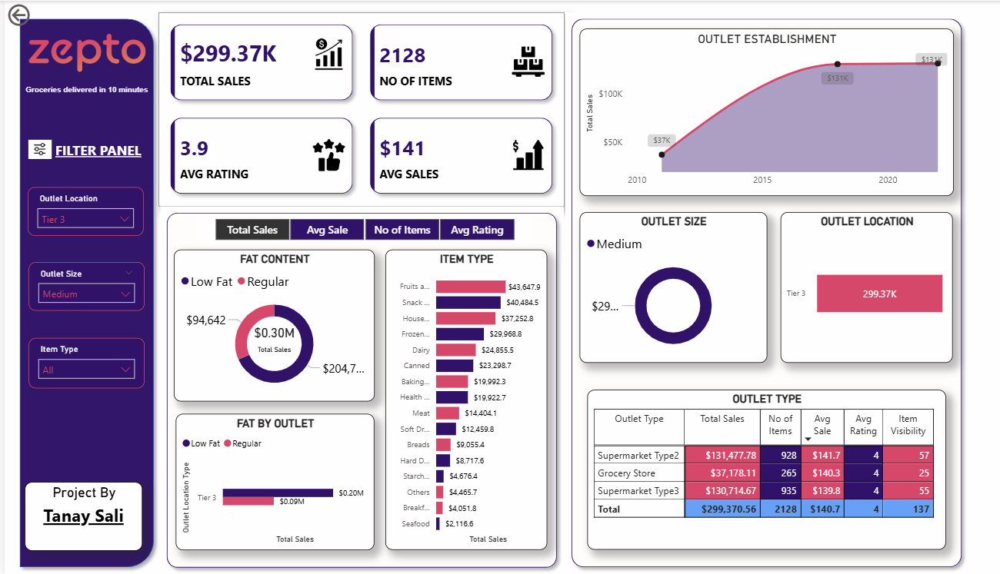

# ZEPTO_Dashboard

Zepto Sales Dashboard – Power BI Project

## Overview

This project is an interactive sales dashboard built in Power BI to analyze and visualize sales performance for Zepto, an online grocery delivery service.
The dashboard helps identify trends, top-selling products, outlet performance, and customer buying behavior, enabling data-driven business decisions.

## Problem Statement

Zepto’s sales data was stored in raw CSV format and scattered across multiple reports.
Managers faced the following challenges:

1) No centralized dashboard for sales performance tracking.
2) Difficulty identifying top-selling categories and underperforming outlets.
3) Lack of real-time insights for quick decision-making.
4) Manual reporting caused delays and inefficiency.

## Solution Approach

To address these challenges, I created an interactive Power BI dashboard that:
1) Consolidates sales data into a single, visually rich interface.
2) Allows filtering by location, outlet size, and item type.
3) Displays key metrics like Total Sales, Average Sales, Item Counts, and Ratings.
4) Provides visual insights into category performance, outlet comparison, and sales trends over time.

## Features

Dynamic Filters to drill down into specific categories or locations.
Key Metrics Cards: Quick stats on total sales, average sales, items sold, and ratings.
Category-Wise Sales: Breakdown by item type & fat content.
Outlet Analysis: Compare outlet size, location type, and establishment year.
Trend Analysis: Month-wise/Year-wise sales trends.
Interactive Visualizations for faster decision-making.

## Dataset Information

The dataset contains sales data for grocery items, including:

Item Identifier
Item Type
Item Fat Content
Outlet Identifier
Outlet Size
Outlet Location Type
Outlet Establishment Year
Sales Figures & Ratings

## Impact / Outcomes

1) Reduced Reporting Time: From hours to seconds with instant insights.
2) Better Decision-Making: Data-driven inventory & marketing strategies.
3) Revenue Optimization: Identify profitable categories & improve low-performing outlets.
4) Scalable Dashboard: Can be refreshed with updated sales data.

Screenshots

Main sales performance dashboard view.

## Future Enhancements

1) Integration with live data from Zepto’s sales database.
2) Predictive analytics for future sales forecasting.
3) Automated alerts for low stock or low sales outlets.
4) Mobile-friendly dashboard version.
